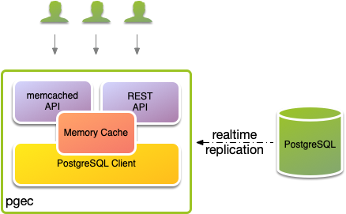

# PostgreSQL Edge Cache (PGEC)

pgec is a real-time in memory database replication cache, with a
memcached and REST API. It supports column lists and row filters with
the latest features of replication in PostgreSQL 15.



The replication process creates a transaction checkpoint ensuring data
integrity. Once the initial data has been collected, streaming
replication starts, receiving changes that have been applied
subsequent to the checkpoint, ensuring no loss of data. Streaming
replication continues keeping [pgec][shortishly-pgec] up to date in
real-time.


A simple example, with a local `postgres` via `docker` to demonstrate
the concepts:

```shell
docker run \
    --rm \
    --name postgres \
    --detach \
    --publish 5432:5432 \
    --pull always \
    --env POSTGRES_PASSWORD=postgres \
    postgres:15 \
    -c wal_level=logical
```

An interactive SQL shell so that we can create some data:

```shell
docker exec \
    --interactive \
    --tty \
    postgres \
    psql \
    postgres \
    postgres
```

Create a demo table:

```sql
create table xy (x integer primary key, y text);
insert into xy
    values
        (1, 'foo'),
        (2, 'bar'),
        (3, 'baz'),
        (4, 'boo');
```

With a PostgreSQL publication for that table:

```sql
create publication pub for table xy;
```

pgec supports [row filters and column lists][shortishly-pgec] in
PostgreSQL 15.

Leave the SQL shell running. Start `pgec` in another terminal. `pgec`
will act as an edge cache for publication we have just created.

```shell
docker run \
    --rm \
    --detach \
    --name pgec \
    --publish 8080:80 \
    --publish 9100:9100 \
    --publish 11211:11211 \
    --pull always \
    -e PGMP_REPLICATION_LOGICAL_PUBLICATION_NAMES=pub \
    -e PGMP_DATABASE_USER=postgres \
    -e PGMP_DATABASE_PASSWORD=postgres \
    -e PGMP_DATABASE_HOSTNAME=host.docker.internal \
    ghcr.io/shortishly/pgec:latest
```

## In Memory Database Replication Cache

On startup `pgec` will initiate a process to replicate the existing
data in the publications. The replication process creates a
transaction checkpoint ensuring data integrity. Once the initial data
has been collected, streaming replication starts, receiving changes
that have been applied subsequent to the checkpoint, ensuring no loss
of data. Real-time streaming replication continues keeping
[pgec][shortishly-pgec] up to date.

[pgec][shortishly-pgec] is a real-time in memory database replication
cache, with a [memcached][memcached-org] and REST API.

### memcached

We can make [memcached][memcached-org] requests to get data from
[pgec][shortishly-pgec] on port 11211.

The keys used have the format: `publication.table.key`. To get the key
"1" from table "xy" and publication: "pub". We would use `get pub.xy.1`
as follows:

```shell
telnet localhost 11211
Trying 127.0.0.1...
Connected to localhost.
Escape character is '^]'.
get pub.xy.1
VALUE pub.xy.1 0 17
{"x":1,"y":"foo"}
END
```

Or, using the [node client][memcached-npmjs-client]:

```javascript
var Memcached = require('memcached');
var memcached = new Memcached('127.0.0.1:11211');

memcached.get('pub.xy.1', function (err, data) {
    console.log(data);
});
```

### REST

Taking a look at the `xy` table via the JSON API:

```shell
curl http://localhost:8080/pub/xy
```

Will return:

```json
{"rows": [{"x": 1, "y": "foo"},
          {"x": 2, "y": "bar"},
          {"x": 4, "y": "boo"},
          {"x": 3, "y": "baz"}]}
```

Where, `pub` is the publication that we have created, and `xy` is a
table that is part of that publication.

Changes that are applied to the PostgreSQL table are automatically
streamed to `pgec` and applied to the edge cache.

```sql
insert into xy values (5, 'pqr');
```

Any CRUD changes to the table are automatically pushed via logical
replication to the `pgec` cache:

```shell
curl http://localhost:8080/pub/xy
```

Will return:

```json
{"rows": [{"x": 5, "y": "pqr"},
          {"x": 1, "y": "foo"},
          {"x": 2, "y": "bar"},
          {"x": 4, "y": "boo"},
          {"x": 3, "y": "baz"}]}
```

To request the value for key `2`:

```shell
curl http://localhost:8080/pub/xy/2
```

Will return:

```json
{"x":2,"y":"bar"}
```

## Monitoring

pgec is instrumented using [telemetry][beam-telemetry] with a
[Prometheus][prometheus] http adapter listening on port 9100.

```shell
docker run \
    --rm \
    --detach \
    --name prometheus \
    --publish 9090:9090 \
    --volume $(pwd)/prometheus.yml:/etc/prometheus/prometheus.yml \
    --pull always \
    prom/prometheus
```

The following sections describe the metrics that are exposed by pgec.

### BEAM

Metrics for the BEAM itself:

* beam_memory, is a gauge recording memory usage in bytes classified
  by type. ETS is the memory store used to replicate data from
  PostgreSQL.
* beam_ports, is a gauge recording file descriptor usage.
* beam_processes, is a gauge recording the number and various types of
  processes.
  
### memcached endpoint

Metrics for the memcached protocol subsystem:

* mcd_tcp_connection_recv_bytes, in the memcached subsystem, the
  number of bytes that have been received.
* mcd_tcp_connection_send_bytes, in the memcached subsystem, the
  number of bytes that have been sent.
  
### REST endpoint

Metrics for the REST endpoint:

* cowboy_request_count, the number of HTTP requests made.
* cowboy_request_duration_ms, cumulative milliseconds taken processing
  all requests.
* cowboy_request_resp_body_length, the cumulative length of all
  response bodies.

### PostgreSQL replication

Metrics for PostgreSQL replication:
  
* pgmp_mm_execute_rows, includes the number of rows processed during
  initial data collection, prior to streaming replication starting.
* pgmp_mm_rep_keepalive_count, a counter of the keep alive requests
  that have been processed.
* pgmp_mm_rep_wal_applied, the index of the WAL that has been applied.
* pgmp_mm_rep_wal_clock, the latest clock value received from the WAL.
* pgmp_mm_rep_wal_flushed, the index of the WAL that has been flushed.
* pgmp_mm_rep_wal_received, the latest index of the WAL that been received.
* pgmp_mm_rep_begin_transaction_count, a counter of the number of
  transactions that have begun.
* pgmp_mm_rep_commit_count, a counter of the number of transactions
  that have been committed.
* pgmp_mm_rep_insert_count, a counter of the number of rows that have
  been inserted during streaming replication.
* pgmp_mm_rep_update_count, a counter of the number of rows that have
  been updated during streaming replication.
* pgmp_mm_rep_delete_count, a counter of the number of rows that have
  been deleted during streaming replication.
* pgmp_mm_rep_truncate_count, a counter of the number table truncates
  that have been processed.

[prometheus]: https://prometheus.io
[beam-telemetry]: https://github.com/beam-telemetry/telemetry
[memcached-npmjs-client]: https://www.npmjs.com/package/memcached
[memcached-org]: https://memcached.org/
[shortishly-pgec]: https://shortishly.com/blog/postgresql-edge-cache/
