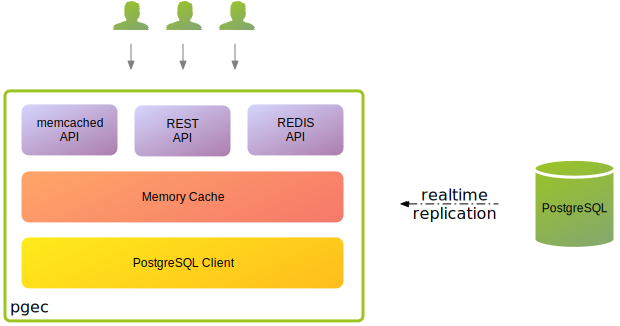

# PostgreSQL Edge Cache (PGEC)

pgec is an Apache licensed real-time in memory PostgreSQL logical
replication cache with Redis, Memcached and REST APIs. It supports
column lists and row filters with the latest features of replication
in PostgreSQL 15.



The replication process creates a transaction checkpoint ensuring data
integrity. Once the initial data has been collected, streaming
replication starts, receiving changes that have been applied
subsequent to the checkpoint, ensuring no loss of data. Streaming
replication continues keeping [pgec][shortishly-pgec] up to date in
real-time.


## Features

- PostgreSQL [logical replication support][pgmp] for [cache
  consistency][shortishly-ccwsr]
- [Redis compatible API][resp]
- [Memcached compatible API][mcd]
- REST API
- a [compose](docs/compose.md) having PostgreSQL with example data,
  [Grafana][grafana], and [Prometheus][prometheus-io].
- a [GitHub Codespace](docs/codespaces.md) for build and development
- Support for [row filters and column lists][shortishly-pgec] in
  PostgreSQL 15

## Quick Start


Clone this repository for the [docker][docker-com-get-docker]
[compose.yaml](compose.yaml) with sample [PostgreSQL][postgresql-org]
data installed.

```shell
git clone https://github.com/shortishly/pgec.git
```

Alternatively, with the [Github CLI][cli-github-com] installed use:

```shell
gh repo clone shortishly/pgec
```

Change to the newly cloned directory:

```shell
cd pgec
```

Start up everything with:

```shell
docker compose --profile all up --detach --remove-orphans
```

Sample data is populated from the scripts in [this
directory](example/initdb.d), using this
[publication](example/initdb.d/020-create-publication.sql). The
compose includes a small load generator using table
`randload`. Grafana dashboards: <http://localhost:3000/>.


The `grades` table is populated with data from:

```csv
"Last name","First name","SSN","Test1","Test2","Test3","Test4","Final","Grade"
"Alfalfa","Aloysius","123-45-6789",40.0,90.0,100.0,83.0,49.0,"D-"
"Alfred","University","123-12-1234",41.0,97.0,96.0,97.0,48.0,"D+"
"Gerty","Gramma","567-89-0123",41.0,80.0,60.0,40.0,44.0,"C"
"Android","Electric","087-65-4321",42.0,23.0,36.0,45.0,47.0,"B-"
"Bumpkin","Fred","456-78-9012",43.0,78.0,88.0,77.0,45.0,"A-"
"Rubble","Betty","234-56-7890",44.0,90.0,80.0,90.0,46.0,"C-"
"Noshow","Cecil","345-67-8901",45.0,11.0,-1.0,4.0,43.0,"F"
"Buff","Bif","632-79-9939",46.0,20.0,30.0,40.0,50.0,"B+"
"Airpump","Andrew","223-45-6789",49.0,1.0,90.0,100.0,83.0,"A"
"Backus","Jim","143-12-1234",48.0,1.0,97.0,96.0,97.0,"A+"
"Carnivore","Art","565-89-0123",44.0,1.0,80.0,60.0,40.0,"D+"
"Dandy","Jim","087-75-4321",47.0,1.0,23.0,36.0,45.0,"C+"
"Elephant","Ima","456-71-9012",45.0,1.0,78.0,88.0,77.0,"B-"
"Franklin","Benny","234-56-2890",50.0,1.0,90.0,80.0,90.0,"B-"
"George","Boy","345-67-3901",40.0,1.0,11.0,-1.0,4.0,"B"
"Heffalump","Harvey","632-79-9439",30.0,1.0,20.0,30.0,40.0,"C"
```

Betty Rubble's grades are <http://localhost:8080/pub/grades/234-56-7890>:

```shell
curl -s http://localhost:8080/pub/grades/234-56-7890 | jq
```

```json
{
  "final": 46,
  "first": "Betty",
  "grade": "C-",
  "last": "Rubble",
  "ssn": "234-56-7890",
  "test1": 44,
  "test2": 90,
  "test3": 80,
  "test4": 90
}
```

A 'C-' seems harsh, lets give her a 'C' instead:

```shell
docker compose exec \
    --no-TTY \
    postgres \
    psql \
    --command="update grades set grade='C' where ssn='234-56-7890'"
```

Fetching the same row, with the redis API instead:

```shell
redis-cli HGETALL pub.grades.234-56-7890
 1) "test4"
 2) "90"
 3) "test3"
 4) "80"
 5) "test2"
 6) "90"
 7) "test1"
 8) "44"
 9) "ssn"
10) "234-56-7890"
11) "last"
12) "Rubble"
13) "grade"
14) "C"
15) "first"
16) "Betty"
17) "final"
18) "46"
```

Fetching the same row, but with the memcached API instead:

```shell
telnet localhost 11211
Trying ::1...
Connected to localhost.
Escape character is '^]'.
get pub.grades.234-56-7890
VALUE pub.grades.234-56-7890 0 120
{"final":46,"first":"Betty","grade":"C","last":"Rubble","ssn":"234-56-7890","test1":44,"test2":90,"test3":80,"test4":90}
END
```

To retrieve the whole table via the REST API:

```shell
curl -s http://localhost:8080/pub/grades | jq
```

Primary keys via REST API:

```shell
curl -s http://localhost:8080/pub/deniro/Casino | jq
```

```json
{
  "score": 80,
  "title": "Casino",
  "year": 1995
}
```

The same via the Redis API:

```shell
redis-cli HGETALL pub.deniro.Casino

1) "year"
2) "1995"
3) "title"
4) "Casino"
5) "score"
6) "80"
```

Composite keys:

```shell
curl -s http://localhost:8080/pub/cities/Tulsa/OK | jq
```

```json
{
  "city": "Tulsa",
  "ew": "W",
  "lat_d": 36,
  "lat_m": 9,
  "lat_s": 35,
  "lon_d": 95,
  "lon_m": 54,
  "lon_s": 36,
  "ns": "N",
  "state": "OK"
}
```

## In Memory Database Replication Cache

[pgec][shortishly-pgec] is a real-time in memory database replication
cache, with a [memcached][memcached-org] and REST API.

### memcached

We can make [memcached][memcached-org] requests to get data from
[pgec][shortishly-pgec] on port 11211.

The keys used have the format: `publication.table.key`. To get the key
"1" from table "xy" and publication: "pub". We would use `get pub.xy.1`
as follows:

```shell
telnet localhost 11211
Trying 127.0.0.1...
Connected to localhost.
Escape character is '^]'.
get pub.xy.1
VALUE pub.xy.1 0 17
{"x":1,"y":"foo"}
END
```

Or, using the [node client][memcached-npmjs-client]:

```javascript
var Memcached = require('memcached');
var memcached = new Memcached('127.0.0.1:11211');

memcached.get('pub.xy.1', function (err, data) {
    console.log(data);
});
```

### REST

Taking a look at the `xy` table via the JSON API:

```shell
curl http://localhost:8080/pub/xy
```

Will return:

```json
{"rows": [{"x": 1, "y": "foo"},
          {"x": 2, "y": "bar"},
          {"x": 4, "y": "boo"},
          {"x": 3, "y": "baz"}]}
```

Where, `pub` is the publication that we have created, and `xy` is a
table that is part of that publication.

Changes that are applied to the PostgreSQL table are automatically
streamed to `pgec` and applied to the edge cache.

```sql
insert into xy values (5, 'pqr');
```

Any CRUD changes to the table are automatically pushed via logical
replication to the `pgec` cache:

```shell
curl http://localhost:8080/pub/xy
```

Will return:

```json
{"rows": [{"x": 5, "y": "pqr"},
          {"x": 1, "y": "foo"},
          {"x": 2, "y": "bar"},
          {"x": 4, "y": "boo"},
          {"x": 3, "y": "baz"}]}
```

To request the value for key `2`:

```shell
curl http://localhost:8080/pub/xy/2
```

Will return:

```json
{"x":2,"y":"bar"}
```

[cli-github-com]: https://cli.github.com
[docker-com-get-docker]: https://docs.docker.com/get-docker/
[grafana]: https://grafana.com/
[mcd]: https://github.com/shortishly/mcd
[memcached-npmjs-client]: https://www.npmjs.com/package/memcached
[memcached-org]: https://memcached.org/
[pgmp]: https://github.com/shortishly/pgmp
[postgresql-org]: https://www.postgresql.org/
[prometheus-io]: https://prometheus.io
[resp]: https://github.com/shortishly/resp
[shortishly-ccwsr]: https://shortishly.com/blog/cache-consistency-with-streaming-replication/
[shortishly-pgec]: https://shortishly.com/blog/postgresql-edge-cache/
