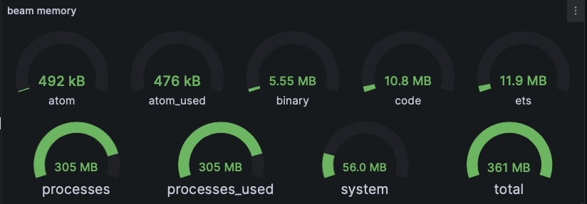

# Monitoring

pgec is instrumented using [telemetry][telemetry] with a
[Prometheus][prometheus-io] http adapter listening on port 9100.

Grafana dashboards: <http://localhost:3000/>.

The following sections describe the metrics that are exposed by pgec.

## BEAM

Metrics for the BEAM itself:

* `beam_memory`, is a gauge recording memory usage in bytes classified
  by type..
* `beam_ports`, is a gauge recording file descriptor usage.
* `beam_processes`, is a gauge recording the number and various types of
  processes.

## Storage Cache

The storage cache is a memory KV cache (implemented using
[ETS][erlang-org-ets]), automatically expiring unused values.

* `pgec_storage_cache`, labelled with the action (hit, miss, expired,
  delete, update, insert)

## Storage Backend

Storage requests that are processed by the storage backend
(leveled). Reads that are as a result of a cache miss, and all writes
will be processed by the storage backend:

* pgec_storage_delete_count, requests to delete a key from the store.
* pgec_storage_get_count, requests to read a value represented by a
  key from the store.
* pgec_storage_put_count, requests to associate a key with a value.

## redis compatible API endpoint

Metrics for the redis compatible protocol subsystem:

* `resp_listener_accept`, `resp_listener_bind`,
  `resp_listener_connect` `resp_listener_listen`, `resp_listener_open`
  and `resp_listener_select`, are all listener socket state metrics.
* `resp_connection_connect`, `resp_connection_decode`,
  `resp_connection_encode`, `resp_connection_open`,
  `resp_connection_recv`, `resp_connection_send`, are connection
  metrics including protocol decoding/encoding of messages, and the
  sending or receiving of protocol data.

## memcached compatible API endpoint

Metrics for the memcached protocol subsystem:

* mcd_tcp_connection_recv_bytes, in the memcached subsystem, the
  number of bytes that have been received.
* mcd_tcp_connection_send_bytes, in the memcached subsystem, the
  number of bytes that have been sent.
  
## REST endpoint

Metrics for the REST endpoint:

* cowboy_request_count, the number of HTTP requests made.
* cowboy_request_duration_ms, cumulative milliseconds taken processing
  all requests.
* cowboy_request_resp_body_length, the cumulative length of all
  response bodies.

## PostgreSQL replication

Metrics for PostgreSQL replication:

  
* pgmp_mm_execute_rows, includes the number of rows processed during
  initial data collection, prior to streaming replication starting.
* pgmp_mm_rep_keepalive_count, a counter of the keep alive requests
  that have been processed.
* pgmp_mm_rep_wal_applied, the index of the WAL that has been applied.
* pgmp_mm_rep_wal_clock, the latest clock value received from the WAL.
* pgmp_mm_rep_wal_flushed, the index of the WAL that has been flushed.
* pgmp_mm_rep_wal_received, the latest index of the WAL that been received.
* pgmp_mm_rep_begin_transaction_count, a counter of the number of
  transactions that have begun.
* pgmp_mm_rep_commit_count, a counter of the number of transactions
  that have been committed.
* pgmp_mm_rep_insert_count, a counter of the number of rows that have
  been inserted during streaming replication.
* pgmp_mm_rep_update_count, a counter of the number of rows that have
  been updated during streaming replication.
* pgmp_mm_rep_delete_count, a counter of the number of rows that have
  been deleted during streaming replication.
* pgmp_mm_rep_truncate_count, a counter of the number table truncates
  that have been processed.

[erlang-org-ets]: https://www.erlang.org/doc/man/ets
[prometheus-io]: https://prometheus.io
[telemetry]: https://github.com/beam-telemetry/telemetry
